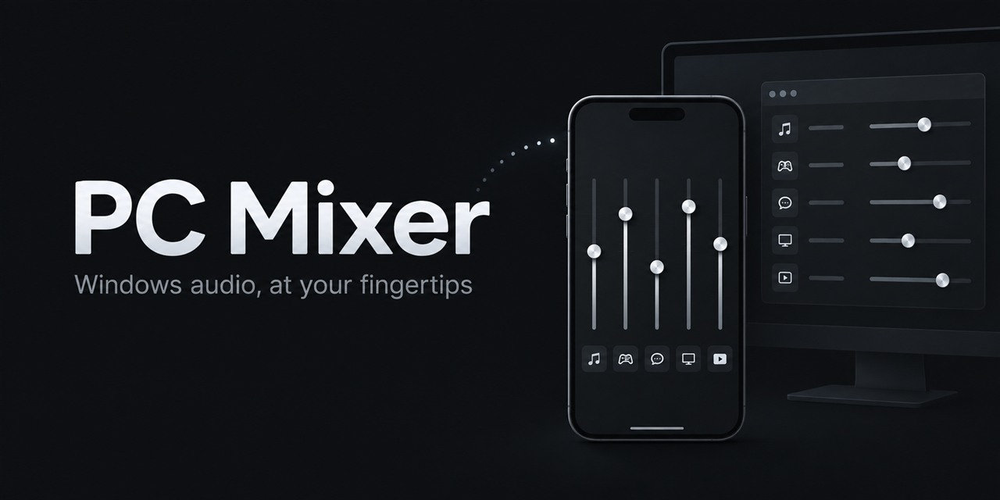

# PC Mixer

Control the volume of individual Windows apps from a phone. PC Mixer runs a small server on your PC and opens a touch-friendly mixer in any phone browser on the same local network. No phone app, account, or cloud service is needed.

## What it does

- **Fixed view:** one channel follows the last focused app with a Windows audio session; four more channels stay assigned to apps you choose.
- **Active view:** shows apps currently present in the Windows audio mixer.
- **Live controls:** drag faders and tap mute from your PC or phone. Multiple channels for the same app move together.
- **Easy assignment:** pick fixed apps from the current audio-session list, or enter an `.exe` name manually.
- **Optional startup:** launch the server when you sign in to Windows.

PC Mixer groups audio sessions by executable. If an app has several sessions, its channel shows their average volume; moving the fader sets every session to the selected level.

## Get started

**Requirements:** Windows 10 or 11; Python 3.10–3.12; an internet connection for the first setup; and a PC and phone on the same local network.

1. Install [Python for Windows](https://www.python.org/downloads/windows/) if needed. During setup, select **Add python.exe to PATH**. The Windows `py` launcher also works.
2. Download this repository with **Code → Download ZIP** or clone it, then place it in a permanent folder such as `C:\Tools\PCMixer`.
3. Run **`Install_PC_Mixer.bat`**. It creates a local `.venv`, installs the Python dependencies, adds **PC Mixer** and **Stop PC Mixer** shortcuts to your desktop and the project folder, and starts the server.
4. On the PC, open **Settings (⚙) → Open on phone**. Enter the displayed address in your phone browser, for example `http://192.168.1.25:8765`.

For later use, start PC Mixer from its shortcut or `Start_PC_Mixer.bat`; use **Stop PC Mixer** to shut it down. You only need to run setup again if you move the project folder or want to recreate the shortcuts.

The repository contains source code, not a standalone executable. Its `.venv` and shortcuts are created separately on each PC and are intentionally excluded from Git.

## Using the mixer

In **Fixed**, the first channel remembers the last focused app that has an audio session. Focusing an app without one, such as File Explorer, leaves that channel on the previous audio app. Assign the other four channels in **Settings (⚙)**. An assigned app remains visible as **OFFLINE** when its audio session disappears.

In **Active**, PC Mixer shows the sessions Windows Core Audio currently reports. An app can remain there for a while after playback stops if Windows keeps its session alive.

Drag a fader to set an app's volume, or tap its speaker button to mute or unmute it. Changes made in Windows or from another open PC Mixer page are reflected in the interface. **Start with Windows** in Settings controls automatic startup for your Windows user account; it does not open a browser at sign-in.

## If the phone cannot connect

1. Check that the PC and phone are on the same LAN or Wi-Fi network. A VPN can interfere with local connections.
2. If Windows Firewall prompts you, allow PC Mixer on **Private networks**.
3. If needed, run `Enable_LAN_Access.bat` on the PC. It requests administrator approval to open TCP port 8765 for Private networks only.

PC Mixer has no login or remote access layer. Use it only on a trusted local network, and do not forward port 8765 from your router to the internet.

## How it works

The PC runs a [FastAPI](https://fastapi.tiangolo.com/) server. [pycaw](https://github.com/AndreMiras/pycaw) provides access to Windows Core Audio sessions and their volume and mute controls. The browser UI is plain HTML, CSS, and JavaScript; it talks directly to the local server. Thanks to the `pycaw` project for making Windows audio control available from Python.

Settings are saved in `%APPDATA%\PCMixer\config.json` on the PC.

## Development

After setup, run the Python tests from the project folder:

```powershell
.\.venv\Scripts\python.exe -m unittest discover -s tests -v
```

The optional JavaScript tests require Node.js:

```powershell
node --test tests\test_frontend.cjs
```

The server code is in `app/`, the browser UI is in `app/static/`, and the launch and setup scripts are at the project root and in `tools/`.
